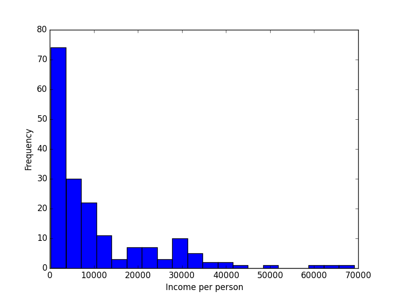
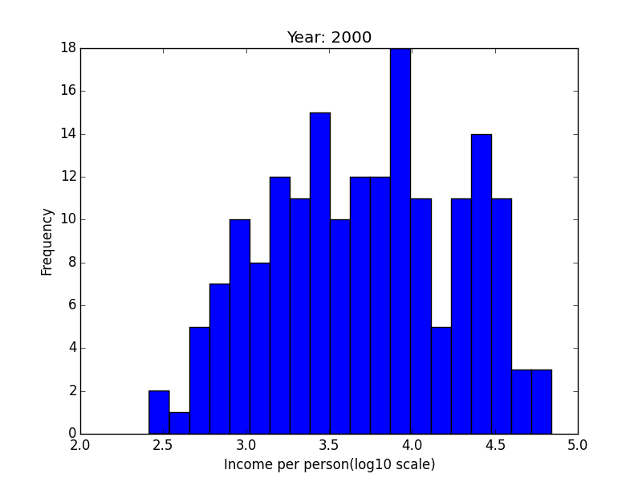
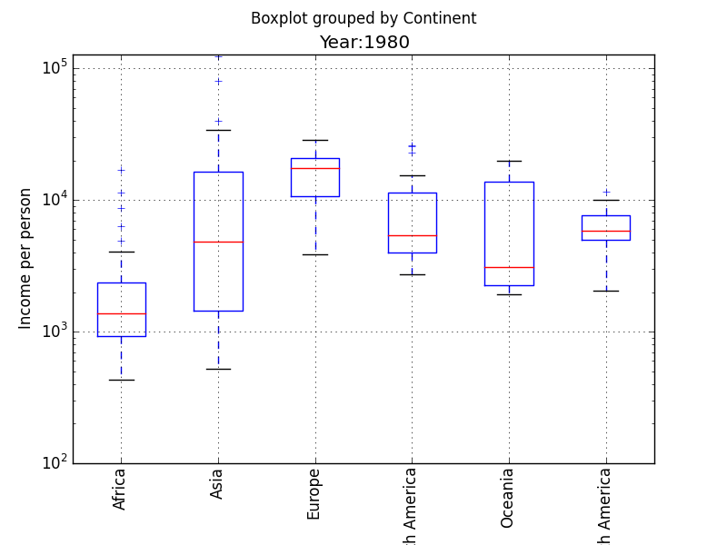
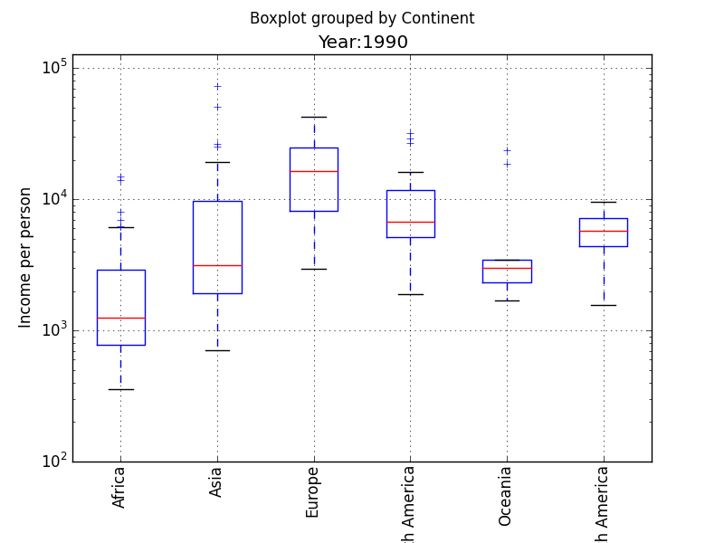
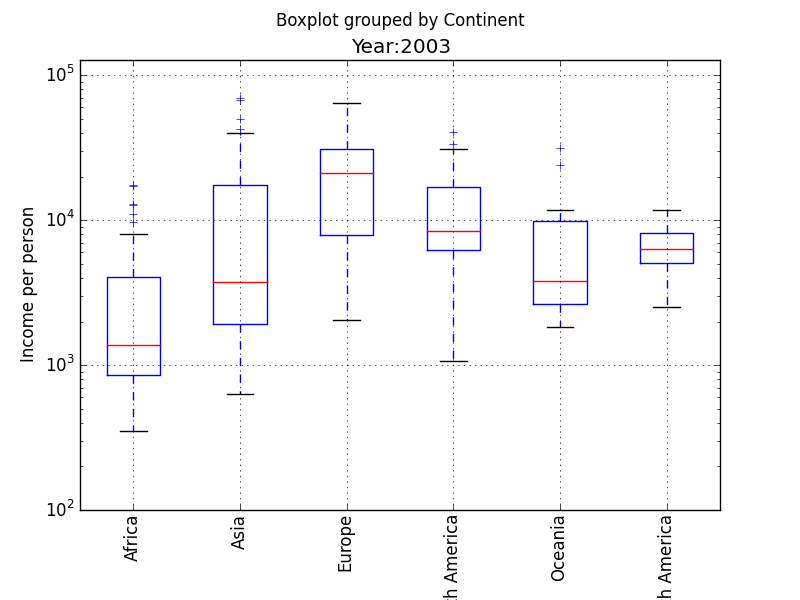

## Data Analysis using Pandas, Matplotlib and Numpy

We've seen data analysis using Numpy during last session. 

**Pandas** is yet another but powerful tool for data munging. In this session, we will explore how to use Pandas, Numpy and Matplotlib.

Let's try to determine whether the gap between Africa/Latin America/Asia and Europe/North America has increased, decreased or stayed the same during the last two decades. 

#### Loading files

Using the list of countries from World Atlas data, let's load `countries.csv` file into Pandas DataFrame using `pd.read_csv` into `countries_df`.

~~~{.python}
import pandas as pd
countries_df=pd.read_csv('../data/countries.csv')
countries_df.head(5)
~~~

~~~{.output}
  Continent   Country
0    Africa   Algeria
1    Africa    Angola
2    Africa     Benin
3    Africa  Botswana
4    Africa   Burkina
~~~
Let's load Gapminder GDP per capita by Purchasing Power Parties and adjusted for inflation  World Bank data as a pandas data frame.

~~~{.python}
complete_GDP=pd.read_excel('../data/indicator_WB_GDP.xlsx')
complete_GDP.head(5)
~~~

~~~{.output}
 GDP per capity, 2005 ppp, WB data         1980         1981         1982  \
0                       Afghanistan          NaN          NaN          NaN   
1                           Albania  4241.822480  4397.101349  4441.090088   
2                           Algeria  6358.196927  6336.322495  6522.698293   
3                    American Samoa          NaN          NaN          NaN   
4                           Andorra          NaN          NaN          NaN   

          1983         1984         1985         1986         1987  \
0          NaN          NaN          NaN          NaN          NaN   
1  4404.391583  4260.021529  4238.547755  4365.299637  4216.080841   
2  6654.029143  6806.901254  6846.265732  6675.716338  6446.264094   
3          NaN          NaN          NaN          NaN          NaN   
4          NaN          NaN          NaN          NaN          NaN   

          1988     ...              2002         2003         2004  \
0          NaN     ...        568.551946   631.782712   672.079195   
1  4053.640737     ...       5253.756466  5522.970763  5814.835828   
2  6212.727651     ...       6344.119808  6681.642459  6924.379244   
3          NaN     ...               NaN          NaN          NaN   
4          NaN     ...               NaN          NaN          NaN   

          2005         2006         2007         2008         2009  \
0   748.112813   808.902073   874.197993   879.032676  1029.215154   
1  6101.576853  6376.603379  6725.003521  7216.119498  7427.807916   
2  7168.564544  7201.681842  7305.142336  7367.171813  7431.280165   
3          NaN          NaN          NaN          NaN          NaN   
4          NaN          NaN          NaN          NaN          NaN   

          2010         2011  
0  1082.949267          NaN  
1  7660.043814  7861.131481  
2  7564.391141  7643.171434  
3          NaN          NaN  
4          NaN          NaN  
~~~

#### Transforming the data

In this section, we will be transforming `complete_GDP` data frame to have **years** as the rows and **countries** as the columns.

~~~{.python}
complete_GDP.index = complete_GDP[complete_GDP.columns[0]]
transform=complete_GDP.drop(complete_GDP.columns[0], axis=1)
transform.columns=map(lambda x: int(x), transform.columns)
transform = transform.T
transform.head(5)
~~~

~~~{.output}
GDP per capity, 2005 ppp, WB data  Afghanistan      Albania      Algeria  \
1980                                       NaN  4241.822480  6358.196927   
1981                                       NaN  4397.101349  6336.322495   
1982                                       NaN  4441.090088  6522.698293   
1983                                       NaN  4404.391583  6654.029143   
1984                                       NaN  4260.021529  6806.901254   

GDP per capity, 2005 ppp, WB data  American Samoa  Andorra  Angola  \
1980                                          NaN      NaN     NaN   
1981                                          NaN      NaN     NaN   
1982                                          NaN      NaN     NaN   
1983                                          NaN      NaN     NaN   
1984                                          NaN      NaN     NaN   

GDP per capity, 2005 ppp, WB data  Antigua and Barbuda     Argentina  Armenia  \
1980                                       7331.092342  10075.425536      NaN   
1981                                       7695.011658   9358.950810      NaN   
1982                                       7801.541186   8760.210721      NaN   
1983                                       8288.317189   8961.579696      NaN   
1984                                       9245.519503   9021.389753      NaN   

GDP per capity, 2005 ppp, WB data  Aruba  ...    Tokelau  Transnistria  USSR  \
1980                                 NaN  ...        NaN           NaN   NaN   
1981                                 NaN  ...        NaN           NaN   NaN   
1982                                 NaN  ...        NaN           NaN   NaN   
1983                                 NaN  ...        NaN           NaN   NaN   
1984                                 NaN  ...        NaN           NaN   NaN   

GDP per capity, 2005 ppp, WB data  Wallis et Futuna  West Germany  \
1980                                            NaN           NaN   
1981                                            NaN           NaN   
1982                                            NaN           NaN   
1983                                            NaN           NaN   
1984                                            NaN           NaN   

GDP per capity, 2005 ppp, WB data  Western Sahara  \
1980                                          NaN   
1981                                          NaN   
1982                                          NaN   
1983                                          NaN   
1984                                          NaN   

GDP per capity, 2005 ppp, WB data  Yemen Arab Republic (Former)  \
1980                                                        NaN   
1981                                                        NaN   
1982                                                        NaN   
1983                                                        NaN   
1984                                                        NaN   

GDP per capity, 2005 ppp, WB data  Yemen Democratic (Former)  Yugoslavia  \
1980                                                     NaN         NaN   
1981                                                     NaN         NaN   
1982                                                     NaN         NaN   
1983                                                     NaN         NaN   
1984                                                     NaN         NaN   

GDP per capity, 2005 ppp, WB data  Åland  
1980                                 NaN  
1981                                 NaN  
1982                                 NaN  
1983                                 NaN  
1984                                 NaN  

[5 rows x 260 columns]
~~~

The explanation is as below:

`complete_GDP[complete_GDP.columns[0]]` will return the first column of `complete_GDP` data frame, and then we are setting the column gdpc 2005 as the index of our data frame. 
But we dont want index and the first column to be the same, so we are going to delete this column. we are deleting this column using `drop` command.

~~{.python}
transform = complete_GDP.drop(complete_GDP.columns[0], axis = 1)
~~~

After deleting the `gdp pc` column, we are converting year values from float to integers. 

Now, we are transposing this data frame:

~~~{.python}
transform.columns = map(lambda x: int(x), transform.columns)
~~~

~~~{.output}
                                           1980          1981          1982  \
GDP per capity, 2005 ppp, WB data                                             
Afghanistan                                 NaN           NaN           NaN   
Albania                             4241.822480   4397.101349   4441.090088   
Algeria                             6358.196927   6336.322495   6522.698293   
American Samoa                              NaN           NaN           NaN   
Andorra                                     NaN           NaN           NaN   
Angola                                      NaN           NaN           NaN   
Antigua and Barbuda                 7331.092342   7695.011658   7801.541186   
Argentina                          10075.425536   9358.950810   8760.210721   
Armenia                                     NaN           NaN           NaN   
Aruba                                       NaN           NaN           NaN   
Australia                          19770.024788  20121.903231  20427.911541   
Austria                            20768.790570  20686.026128  21073.664081   
Azerbaijan                                  NaN           NaN           NaN   
Bahamas                            26044.900179  23122.567612  24127.197982   
Bahrain                            21139.012573  19255.714430  17257.531319   
Bangladesh                           676.807527    683.390319    680.958079   
Barbados                           14938.804978  14406.502529  13625.228090   
Belarus                                     NaN           NaN           NaN   
Belgium                            20792.884911  20735.360605  20864.402818   
Belize                              3342.015744   3297.233894   3203.362708   
Benin                               1134.067853   1213.972757   1207.678968   
Bermuda                                     NaN           NaN           NaN   
Bhutan                                      NaN    938.805421    990.795433   
Bolivia                             3779.035629   3707.459306   3486.103150   
Bosnia and Herzegovina                      NaN           NaN           NaN   
Botswana                            3432.585747   3610.803976   3910.678789   
Brazil                              7566.517959   7067.068960   6944.957290   
Brunei                             80588.015244  62594.982803  63162.180498   
Bulgaria                            5830.317333   6095.663470   6219.545283   
Burkina Faso                         613.273648    624.106617    667.177965  
~~~

### Plotting a histogram

Let's plot a histogram for the year 2000. Here, we will use `dropna` to exclude missing values for the year 2000. 
Also, `.ix` enables us to select a subset of the rows and columns from a DataFrame.

~~~{.python}
years=2000
import matplotlib.pyplot as plt
plt.hist(transform.ix[years].dropna().values, bins=20)	
plt.xlabel("Income per person")
plt.ylabel("Frequency")
plt.show()
~~~

We are using log scales to plot the values.

~~~{.python}
years=2000
import numpy as np
plt.hist(np.log10(transform.ix[years].dropna().values), bins=20)
plt.title('Year: %i' %years)
plt.xlabel("Income per person(log10 scale)")
plt.ylabel("Frequency")
plt.show()
~~~

### Merging data frames

We will be using `merge` function to merge 2 Data Frames. (data_GDP and countries_df)

~~~{.python}
def mergeByYear(year):
    data_GDP=pd.DataFrame(transform.ix[year].values, columns=['Income'])
    data_GDP['Country']=transform.columns
    combined=pd.merge(data_GDP, countries_df, on=['Country'])
    combined.Income=np.round(combined.Income,2)
    return combined

mergeByYear(2000)
~~~

~~~{.output}
      Income                 Country      Continent
0         NaN             Afghanistan           Asia
1     4799.51                 Albania         Europe
2     6081.41                 Algeria         Africa
3         NaN                 Andorra         Europe
4     2476.18                  Angola         Africa
5    16330.94     Antigua and Barbuda  North America
6    10282.41               Argentina  South America
7     2295.36                 Armenia         Europe
8    29662.97               Australia        Oceania
9    31775.73                 Austria         Europe
10    2489.95              Azerbaijan         Europe
11   30837.54                 Bahamas  North America
12   23725.57                 Bahrain           Asia
13     969.78              Bangladesh           Asia
14   18175.87                Barbados  North America
15    5810.04                 Belarus         Europe
16   30398.45                 Belgium         Europe
17    5620.66                  Belize  North America
18    1306.46                   Benin         Africa
19    2703.12                  Bhutan           Asia
20    3566.99                 Bolivia  South America
21    5095.96  Bosnia and Herzegovina         Europe
22    9530.94                Botswana         Africa
23    7909.11                  Brazil  South America
24   48478.17                  Brunei           Asia
25    7117.57                Bulgaria         Europe
26     496.31                 Burundi         Africa
27    1035.49                Cambodia           Asia
28    1853.24                Cameroon         Africa
29   32446.79                  Canada  North America
..        ...                     ...            ...
147   3005.39               Sri Lanka           Asia
148   1396.90                   Sudan         Africa
149   4963.96                Suriname  South America
150   4448.16               Swaziland         Africa
151  29145.49                  Sweden         Europe
152  34713.24             Switzerland         Europe
153   3755.67                   Syria           Asia
154    968.77              Tajikistan           Asia
155    868.05                Tanzania         Africa
156   5496.85                Thailand           Asia
157    916.07                    Togo         Africa
158   3865.58                   Tonga        Oceania
159  13907.25     Trinidad and Tobago  North America
160   6077.35                 Tunisia         Africa
161   9827.63                  Turkey           Asia
162   2322.36            Turkmenistan           Asia
163       NaN                  Tuvalu        Oceania
164    773.55                  Uganda         Africa
165   3696.44                 Ukraine         Europe
166  69078.06    United Arab Emirates           Asia
167  29056.47          United Kingdom         Europe
168  39544.96           United States  North America
169   9608.99                 Uruguay  South America
170   1632.30              Uzbekistan           Asia
171   3794.15                 Vanuatu        Oceania
172   9564.47               Venezuela  South America
173   1597.21                 Vietnam           Asia
174   1028.79                  Zambia         Africa
175       NaN                Zimbabwe         Africa
176       NaN                   Nauru        Oceania

[177 rows x 3 columns]

~~~

### Using Box Plot for further data exploration

We will now be generating **box plots** to explore the trends for the years 1980, 1990 and 2003. 
We will also be exploring the trends for the years 1980, 1990, 2000 and 2010. 

We can use `years=np.arange(1980,2010,10)` for doing so.

~~~{.python}
years_box=[1980,1990,2003]

for yr in years_box:
    df=mergeByYear(yr)
    df.boxplot('Income',by='Continent',rot=90)
    plt.title("Year:"+str(yr))
    plt.ylabel("Income per person")
    plt.xlabel("Region")
    plt.ylim(10**2, 10.5 **5)
    plt.yscale('log')
~~~

If you explore the changes from 1980 to 2010, you can see that in most continents (especially Africa and Asia) the distribution of incomes is very skewed: most countries are in a group of low-income states with a fat tail of high-income countries that remains approximately constant throughout the 20th century. 

~~~{.Challenge}
Consider the distribution of income per person from two regions: Asia and South America. Estimate the average income per person across the countries in those two regions. Which region has the larger average of income per person across the countries in that region?  (Use the year 2011). Also create boxplots to see the income distribution of the two continents on the dollar scale and log10(dollar) scale. 
~~~

   

